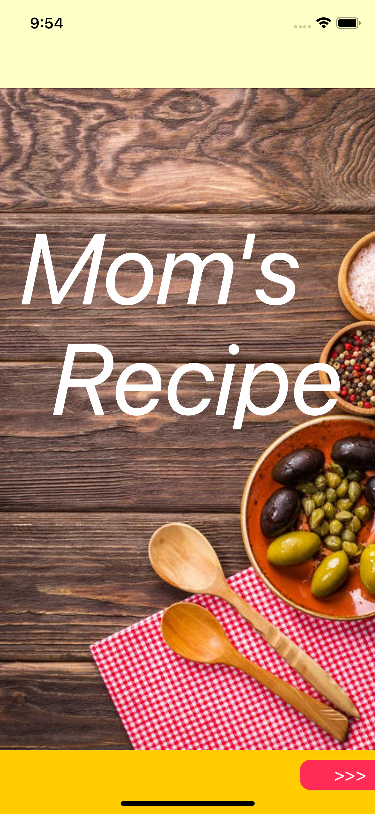
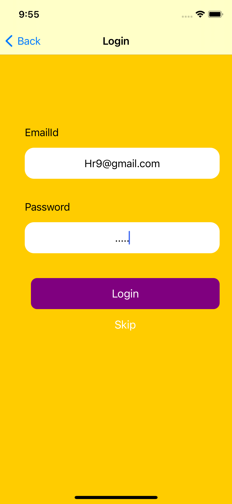
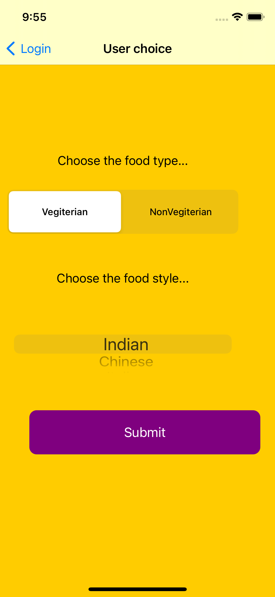
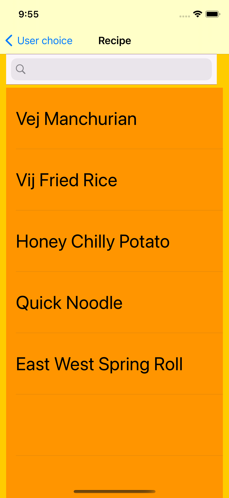
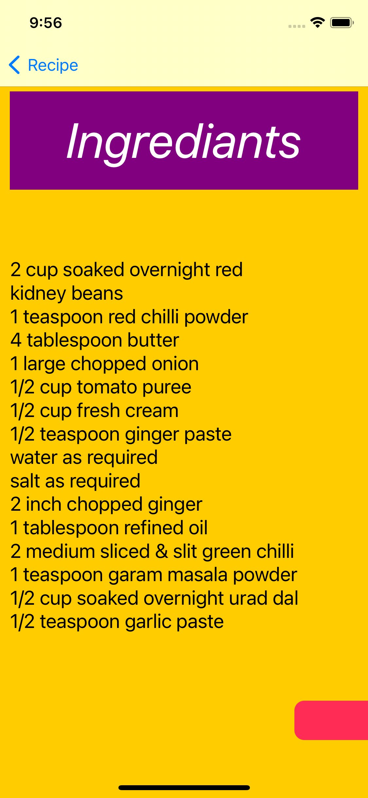
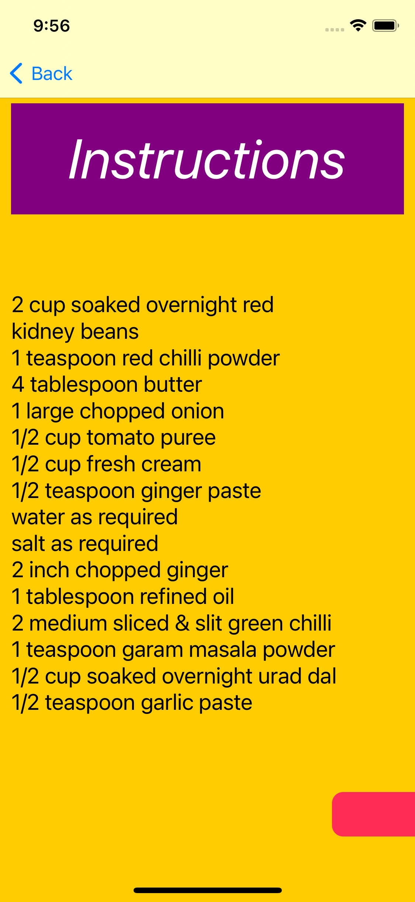
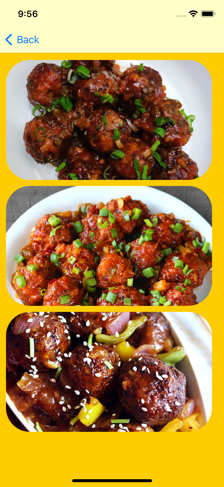

# A3_RecipeApp
In this Application I ahve used table view ,searchbar and many things

This is the home page

This is the login page if you want to login you can or else you can skip it by clicking on skip button

This is the selection Page which kind of food you want and in which style 

As per your choice the particular table view will be open

As you will choose your dish you can see the ingrediants 

then the instruction to amke that particular dish 

Finally how your dish shows that you can see here

